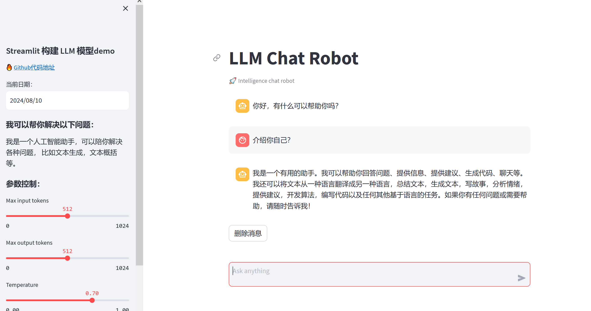

# llm

## streamlit搭建LLM交互应用

### 项目介绍

#### 以Qwen2-7B-Instruct模型为基础模型，分别使用langchain和vllm框架进行模型的推理封装，使用streamlit进行前端展示

LangChain 适用于构建基于大型语言模型的应用程序框架。  \
VLLM 一个针对大型语言模型进行优化推理和部署的引擎方案。

### 开发环境

* Python版本为V3.8+
* streamlit版本为1.24.0
* vllm版本为0.4.0.post1
* langchain版本为0.2.3

### 搭建虚拟环境

* 搭建云服务和python环境，[参考这里](https://github.com/datawhalechina/self-llm/blob/master/models/Qwen2/02-Qwen2-7B-Instruct%20Langchain%20%E6%8E%A5%E5%85%A5.md)非常感谢 @Datawhale 社区。

### 本地运行

* 下载代码
    `git clone https://github.com/hgsw/llm.git`
* 启动服务
    `cd llm/langchain`  \
    `streamlit run langchain_streamlit_demo.py --server.address 127.0.0.1 --server.port 6006`
* 浏览器访问前端地址
    `http://127.0.0.1:6006`

### 界面截图

